# 2025年最佳20+住宅代理服务平台

无论你是做跨境电商数据采集,还是社交媒体多账号运营,或者SEO监控,选对代理服务器直接决定了业务能不能顺利推进。市面上住宅代理服务商越来越多,价格从每GB几美元到十几美元不等,IP池规模从几百万到上亿不等,功能差异也很大。这篇文章整理了20多个经过验证的住宅代理平台,覆盖不同预算和使用场景,帮你快速找到适合自己的方案。

## **[Croxy](https://croxy.com)**

全场景覆盖的住宅代理服务,适合需要稳定长连接的业务场景。

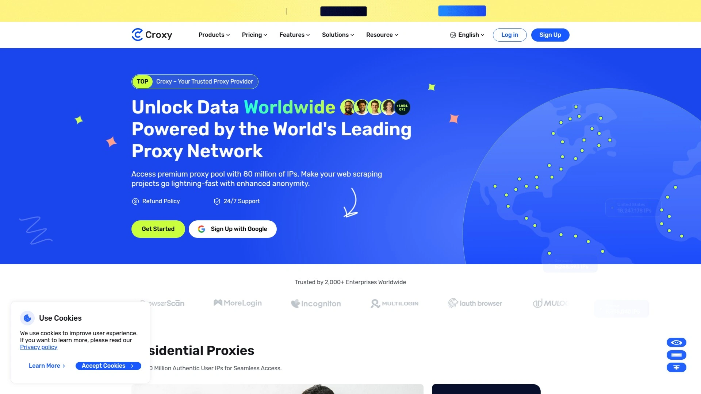

Croxy提供超过8000万真实用户IP,覆盖住宅代理、静态住宅代理、无限流量住宅代理、静态数据中心代理和长效ISP代理等多种类型。服务的核心优势在于连接稳定性,特别适合需要持续访问的场景,比如社交媒体账号管理、电商价格监控、市场调研等。

技术层面支持HTTP和SOCKS5协议,提供多国家地区覆盖,响应速度快。客户服务响应及时,提供详细的配置指南,对于技术团队和业务人员都比较友好。定价模式灵活,既有按流量计费也有包月套餐,适合不同规模的使用需求。

对于跨境电商团队来说,IP纯净度高,很少触发平台风控,这点在实际使用中非常关键。

## **[Bright Data](https://brightdata.com)**

行业标杆级服务商,财富500强企业的首选方案。

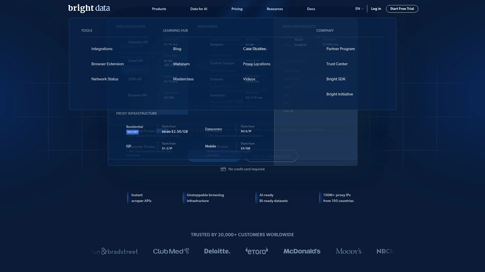

Bright Data前身是Luminati,在住宅代理市场拥有超过15年的运营经验。IP池规模超过1.5亿个住宅IP和700万移动IP,覆盖195个以上国家和地区。成功率达到99.9%以上,平均响应时间约0.51秒,这个性能指标在行业内处于顶尖水平。

最大的特点是提供完整的工具生态系统:精确到城市、邮编甚至ISP级别的地理定位,支持SOCKS5/HTTP/HTTPS多种协议,配备实时统计的高级代理管理仪表板,还有浏览器扩展程序可以无缝集成。企业客户会分配专属客户经理,技术支持响应很快。

**适用场景:**大规模数据采集、企业级应用、需要极高成功率和稳定性的项目。价格相对较高,但质量和服务确实值这个价。

## **[Oxylabs](https://oxylabs.io)**

拥有超过1亿IP的超大规模代理网络。

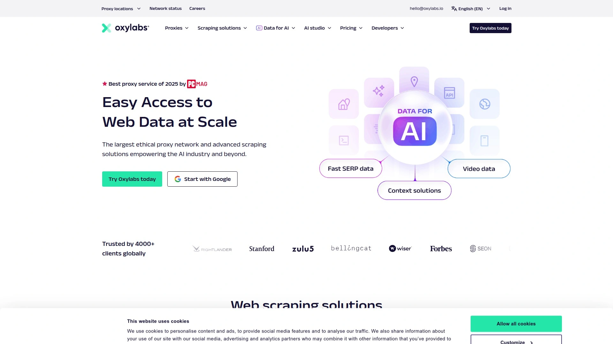

Oxylabs的住宅代理网络规模达到1亿以上IP地址,分布在195个国家。性能指标很出色:成功率99.95%,响应时间约0.6秒。特别擅长处理大规模并发请求,基础设施非常稳健。

除了基础代理服务,还提供专门针对特定任务的API,比如SERP抓取、电商数据采集等。支持城市级别的地理定位,可以精准到具体城市。美国IP资源特别丰富,超过1100万个。

注册前需要提供身份验证,审核比较严格,这也保证了服务质量和合规性。定价从每GB约3.49美元起,提供免费试用。

## **[Smartproxy (现已更名为Decodo)](https://smartproxy.com)**

界面友好、上手简单的高性价比选择。

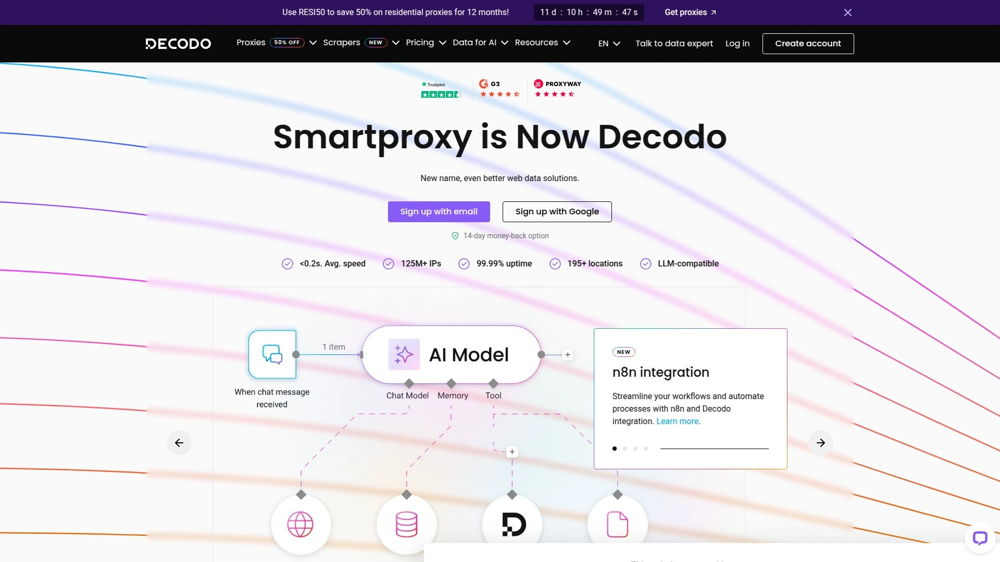

Smartproxy在2024年更名为Decodo,拥有超过6500万住宅IP,覆盖195个以上国家。最大的优势是用户体验做得特别好,仪表板直观易用,即使是非技术背景的用户也能快速上手。

价格比企业级供应商便宜不少,每GB从2.25美元起,在性能、易用性和成本之间取得了很好的平衡。支持HTTP(S)和SOCKS5协议,提供无限并发会话,城市级地理定位,24/7技术支持。

覆盖美国50个州中的至少6个主要城市,虽然没有明确披露所有城市覆盖情况,但实际使用中定位精度不错。适合中小型企业和个人用户,特别是那些需要可靠代理但不想处理复杂企业级解决方案的用户。

## **[NetNut](https://netnut.io)**

直连ISP的高性能代理网络。

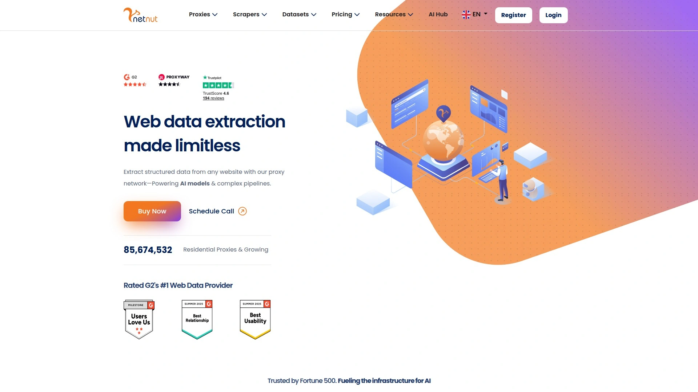

NetNut成立于2017年,拥有超过5200万住宅IP,覆盖200个国家。最大的特色是与ISP建立了直接合作关系,这让连接质量和可靠性都有保障。

针对企业用户和转售商提供了专门的功能:独立代理池、详细的使用统计、代理管理API、子账户系统。定价采用流量计费模式,如果选择年度订阅1TB套餐,价格可以降至每GB 3.6美元。

美国IP资源丰富,但需要注意的是,美国地区提供的主要是ISP代理而不是纯住宅代理。适合需要大规模抓取、对性能要求高的企业客户。

## **[SOAX](https://soax.com)**

灵活筛选功能突出的稳定IP服务。

SOAX提供超过1.55亿住宅IP,覆盖195个以上国家和地区。支持HTTP(S)、SOCKS5以及UDP/QUIC协议,这在代理服务商中比较少见。

筛选功能特别强大,可以按国家、城市、甚至ISP级别进行精确定位。会话控制也很灵活,支持粘性会话和轮换模式,无限并发连接。

除了代理服务,还提供多个抓取API,适合需要一站式解决方案的企业用户。定价采用订阅模式,没有按需付费选项,支付方式相对有限。整体定位偏向企业市场,特别适合需要数据提取和公开数据采集的业务场景。

## **[DataImpulse](https://dataimpulse.com)**

价格实惠但有一定取舍的入门选择。

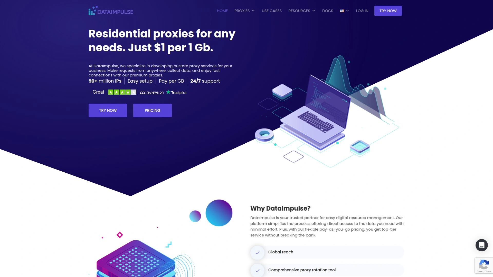

DataImpulse的定价非常有竞争力,是2025年最便宜的住宅代理提供商之一。虽然在某些方面有所取舍,但对于预算有限或刚开始接触住宅代理的用户来说是不错的选择。

提供基础的住宅代理功能,IP池规模虽然不如头部供应商那么大,但覆盖范围也比较广。适合小规模项目、个人开发者或者想要测试住宅代理效果的用户。

需要注意的是,在稳定性和成功率方面可能不如高端供应商,建议根据具体使用场景评估是否合适。

## **[IPRoyal](https://iproyal.com)**

灵活付费模式的良心价代理服务。

IPRoyal拥有超过3200万住宅IP,分布在195个国家。最大的优势是采用按需付费模式,没有月度最低消费或长期承诺,买多少用多少。

流量不过期是个非常实用的功能,如果你不确定需要多少流量,IPRoyal绝对是理想选择。价格从每GB 7美元起,批量购买有大幅折扣,最低可到每GB 2.45美元,企业客户还能获得更好的价格。

粘性会话控制精确到1秒至7天,还提供高端IP池选项,可以获得指定位置最快最稳定的IP。支持无限并发会话,HTTP(S)和SOCKS5协议都支持。美国IP超过145万个,覆盖50个州。

ISP代理有独特的日租套餐,单个ISP代理一天只需1.8美元,比包月更灵活。用户评价很高,Trustpilot评分4.6/5,超过2780条评论。

## **[ProxyEmpire](https://proxyempire.io)**

全球530万+住宅IP的新兴服务商。

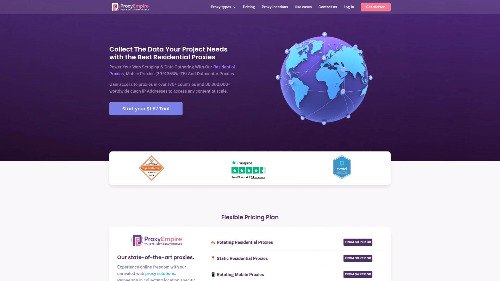

ProxyEmpire提供超过530万住宅IP,覆盖170个以上国家。支持HTTP、HTTPS和SOCKS5(含UDP)协议,这让使用场景更加灵活。

连接方式使用网关地址,轮换选项多样,可以每次请求更换IP,也可以自定义会话。并发连接不限制,只要流量充足就能无限扩展。

地理定位功能强大,可以精确到国家、地区、城市甚至ISP级别。集成配置很简单,通过在用户名中添加参数来自定义访问。定价从每GB 3美元起,提供试用套餐,1.97美元可以测试服务。

需要注意的是不支持IP白名单认证,只能用账号密码方式。用户评价很好,评分4.8/5,虽然评论数量相对较少。

## **[Webshare](https://webshare.io)**

大规模IP池的可定制化服务。

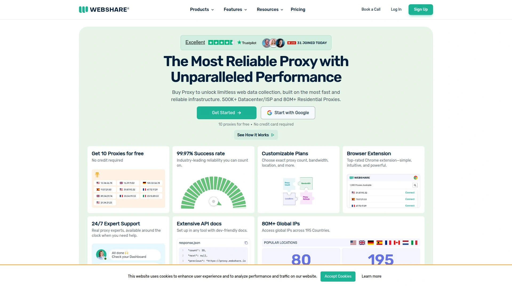

Webshare拥有大规模的IP资源池,提供数据中心代理、静态住宅代理和住宅代理三种产品。服务的可定制化程度很高,可以根据不同需求选择合适的代理类型。

适合需要灵活配置和大规模使用的场景,无论是网页抓取、SEO监控还是广告验证都能胜任。定价合理,在保证质量的前提下性价比不错。

## **[Rayobyte](https://rayobyte.com)**

城市定位和不过期套餐的特色服务商。

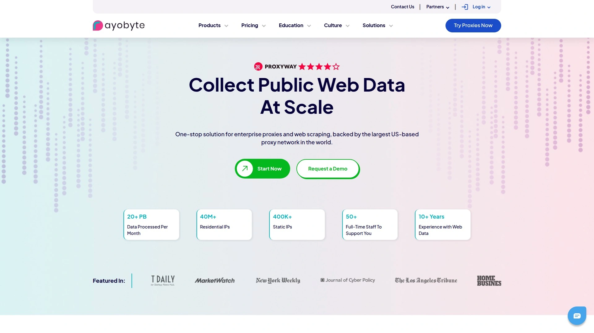

Rayobyte提供住宅代理、数据中心代理和ISP代理。最大的特点是提供城市级别定位功能,而且套餐流量不会过期。

这对于需要精确地理位置控制,或者使用频率不规律的用户来说非常实用。适合做本地化内容测试、区域性市场调研等需要特定城市IP的场景。

价格合理,支持按需购买,不会因为一段时间不用就浪费掉剩余流量。

## **[GeoSurf](https://geosurf.com)**

专注地理定位的老牌代理服务。

GeoSurf是代理服务器市场的老牌玩家之一。虽然价格偏高,但住宅代理的质量和地理定位选项都非常出色。

月费从300美元起,包含37.5GB流量,定位明确是中高端市场。IP池质量高,检测率低,连接稳定性好。

现已被Bright Data收购,专注于提供优质静态代理服务。适合对IP质量要求极高、预算充足的企业用户。

## **[Infatica](https://infatica.io)**

ISO认证的综合性代理解决方案。

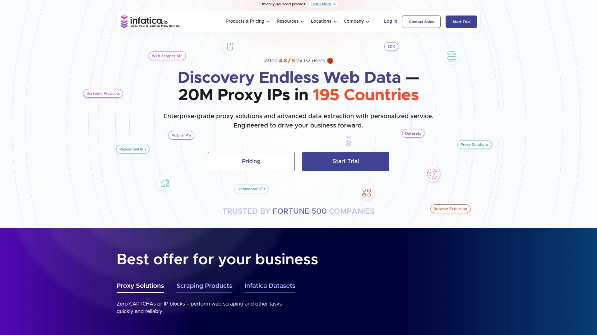

Infatica提供超过2000万IP的代理池,针对价格情报和网络安全场景优化。响应时间快至0.4秒,成功率达到99.99%。

获得ISO/IEC 27001认证,这在代理服务商中并不常见,说明在安全性和合规性方面做得不错。定价从每GB 3.84美元起,提供按需付费和月度套餐两种模式。

7天试用只需4美元,可以充分测试服务是否符合需求。支持通过登录密码或IP白名单两种认证方式。

移动代理网络超过500万IP,覆盖150个以上地区,采用符合道德的IP获取方式,通过SDK与应用开发者合作,用户自愿参与并获得回报。

## **[Shifter](https://shifter.io)**

2012年成立的资深住宅代理供应商。

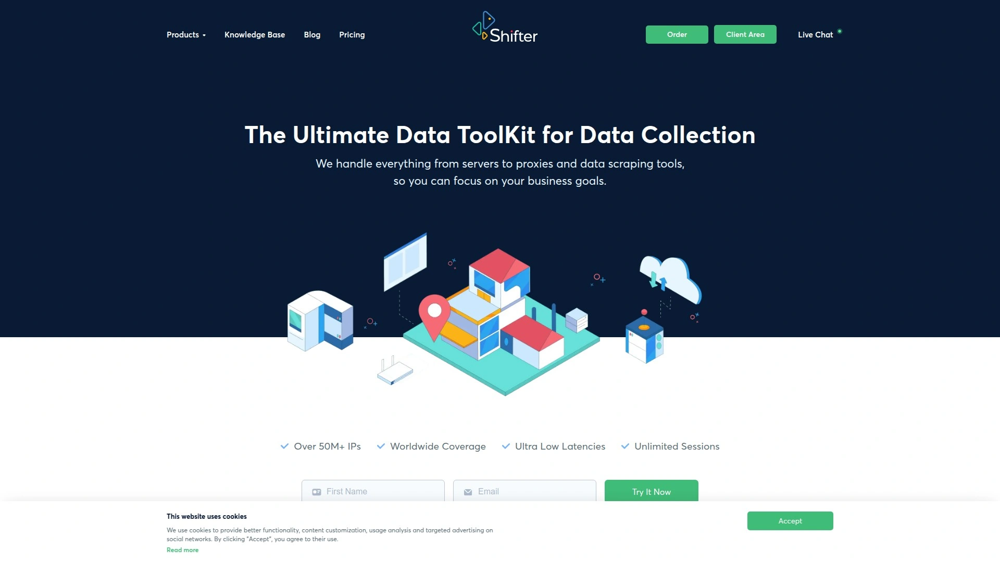

Shifter是最早一批住宅代理提供商之一,成立于2012年,服务超过25000家客户,包括多家财富500强公司。IP池约3100万个,覆盖全球所有国家。

提供三种服务等级:基础版、特殊版和快速轮换版。基础版随机分配二三线国家IP,限制访问主流网站;特殊版解除限制但需要指定最多5个目标网站;快速轮换版在特殊版基础上提高轮换频率。

轮换时间可设置为5到60分钟,支持HTTP(S)和Socks 4/5多种协议。正常运行时间高达99.99%,连接速度快。

配置需要白名单IP地址,选择目标网站和地理位置,操作相对直观。

## **[922 S5 Proxy](https://922proxy.com)**

2亿+IP的超大规模住宅代理网络。

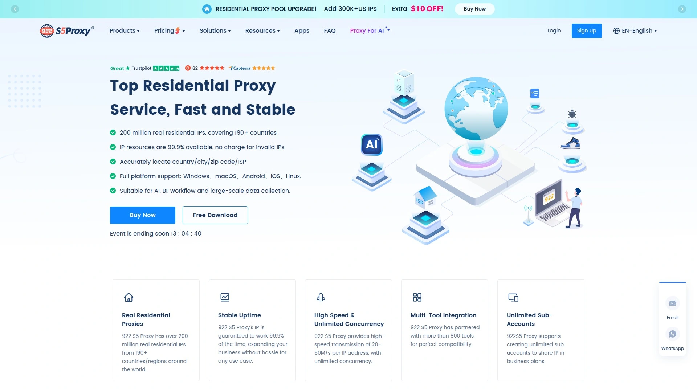

922 S5 Proxy提供超过2亿真实住宅IP,覆盖190个以上国家和地区。IP有效期长达12小时,静态住宅代理有效期可达30天。

带宽不计量,线程数不限,匿名访问保护隐私。下载速度每个IP地址可达20-50M/s,这个速度在住宅代理中非常快。

运行时间保证99.9%,几乎没有停机问题。支持超过800种工具集成,子账户数量不限。

IP纯净度达到99%,比很多竞争对手的检测率低得多。提供住宅代理、ISP代理、静态住宅代理和轮换代理等多种类型。

用户界面友好,支持多操作系统和设备,有API可以方便第三方应用集成。

## **[PacketStream](https://packetstream.io)**

P2P模式的住宅代理网络。

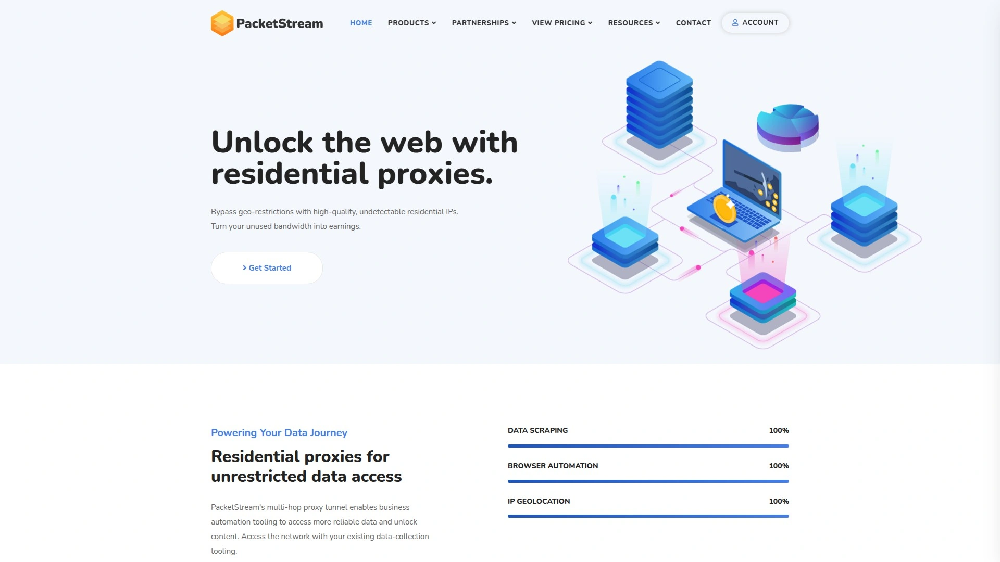

PacketStream采用点对点住宅代理网络模式,让用户能够安全、匿名地访问网络,不受地理限制。

这种P2P模式的特点是IP来源更加分散和真实,模拟真实用户行为的效果好。适合需要高匿名性和地理多样性的使用场景。

定价模式灵活,按流量计费,不用担心固定月费造成浪费。

## **[SquidProxies](https://squidproxies.com)**

自2010年运营的老牌供应商。

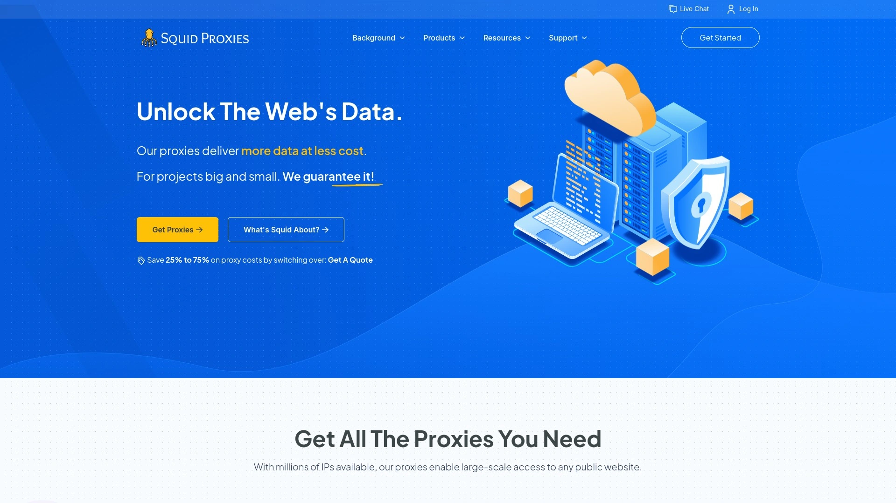

SquidProxies自2010年以来一直在精心构建大规模代理网络,支持各种规模的项目。

最大的优势是定价实惠,相比其他供应商价格竞争力强。服务器位置遍布全球,地理覆盖广。

虽然成立时间早,但一直在更新服务和扩展网络,适合需要稳定长期供应商的用户。

## **[HydraProxy](https://hydraproxy.com)**

无月度承诺的住宅和移动代理。

HydraProxy提供住宅和4G移动代理网络,最大的特点是没有月度承诺。计费周期灵活,没有额外费用。

控制粒度细,可以精确配置代理参数。适合需要灵活使用、不想被套餐绑定的用户。

移动代理在某些场景下比住宅代理更难被检测,特别适合社交媒体管理和移动应用测试。

## **[Proxy-Cheap](https://proxy-cheap.com)**

性价比极高的全类型代理服务。

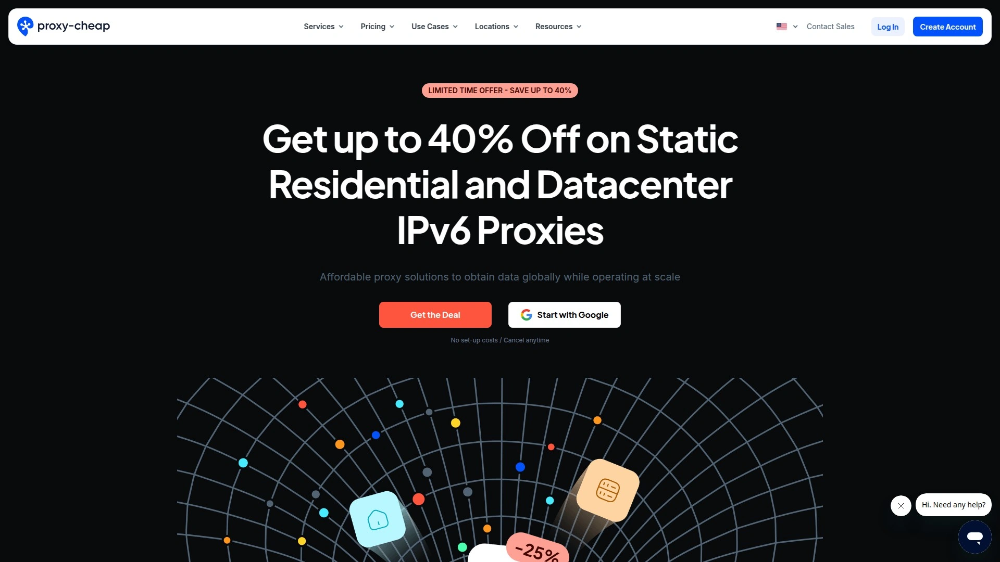

Proxy-Cheap名副其实,提供市面上最实惠的价格之一。静态住宅代理每个从1.27美元起,轮换住宅代理每GB从4.99美元起,数据中心IPv6代理最低只需0.15美元。

覆盖180个以上地区,正常运行时间达99.9%。提供住宅、数据中心、ISP和移动代理全线产品。

没有设置费用,可以随时取消,非常灵活。Trustpilot评分4.4/5,有662条用户评价,满意度高。

适合市场调研、品牌保护、广告验证、SEO监控、旅游票价聚合、社交媒体管理等多种场景。对于预算有限但需要质量代理的用户来说是理想选择。

## **[Evomi](https://evomi.com)**

独特功能的高性价比新选择。

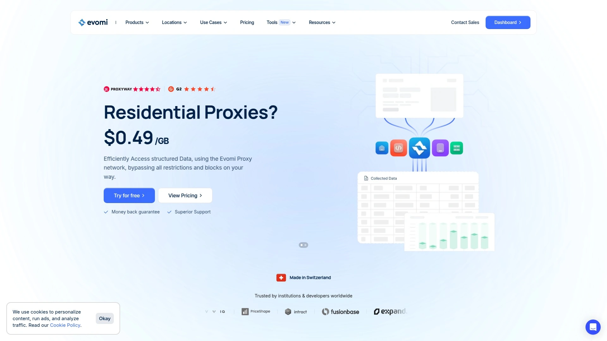

Evomi是相对较新的代理服务商,月费低于100美元,每GB价格优惠。

基础价格实惠的同时,还提供一些独特的额外功能,这让它在入门级市场中很有竞争力。

适合预算有限但想要一些特色功能的中小型项目。

## **[Decodo (前Smartproxy)](https://decodo.com)**

已在前文详细介绍,品牌更名后继续保持高性价比和易用性优势。

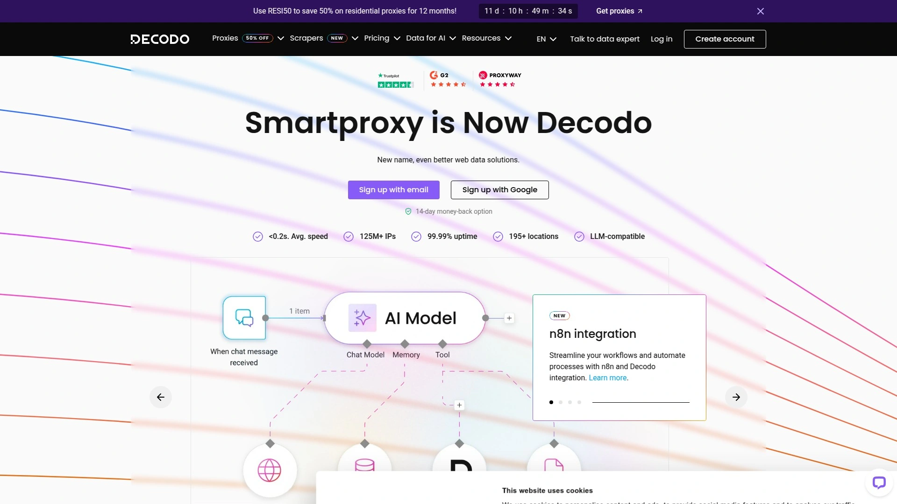

***

## 常见问题

**住宅代理和数据中心代理有什么区别?**

住宅代理使用真实ISP分配的IP地址,来自普通家庭网络,网站很难识别和封禁。数据中心代理来自服务器,速度更快但更容易被检测。如果你需要绕过严格的反爬虫措施,住宅代理是更好的选择;如果追求速度且目标网站检测不严格,数据中心代理更经济。

**静态住宅代理适合什么场景?**

静态住宅代理在较长时间内保持同一个IP地址,非常适合需要IP稳定性和长期会话持久性的任务。典型应用包括电商监控、社交媒体管理、广告验证和网页抓取。因为IP来自真实ISP网络,信任度高,检测风险低,同时又保持了IP一致性,不会因为频繁换IP触发平台风控。

**如何选择合适的代理服务商?**

首先明确使用场景:大规模数据采集选择IP池大、成功率高的供应商如Bright Data或Oxylabs;预算有限选择性价比高的如IPRoyal或Proxy-Cheap;需要特定城市定位选择地理覆盖精确的服务商。其次看技术指标:响应时间、成功率、并发支持、协议类型。最后考虑计费模式:流量是否过期、有无最低消费、是否支持按需付费。建议先试用再正式购买。

***

## 结语

选择合适的住宅代理服务商,关键是要匹配自己的实际需求和预算。如果你正在开展跨境业务或数据采集项目,[Croxy](https://croxy.com)凭借稳定的连接质量、全面的IP类型覆盖和优质的客户服务,特别适合需要长期稳定运行的场景。无论选择哪家服务商,都建议先小规模测试,确认性能和稳定性符合预期后再扩大使用规模。
